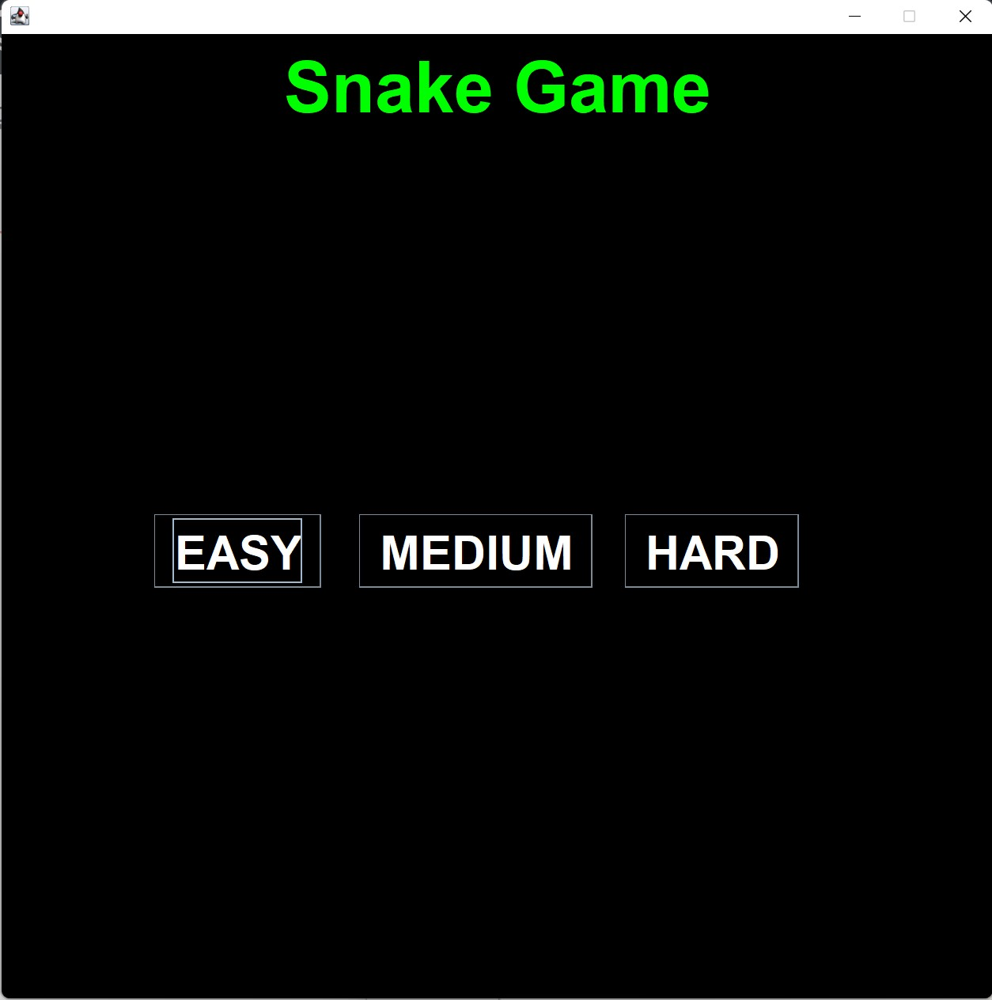
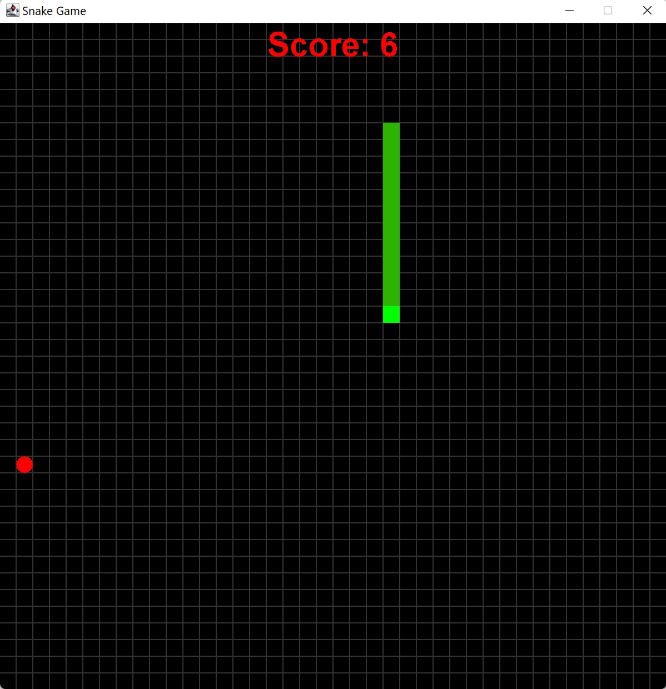
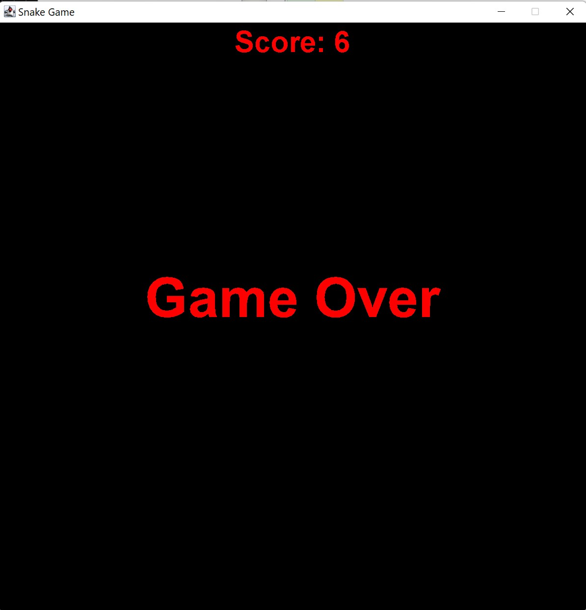

# Snake-Game-Java
This is a recreation of the "google snake game" in java code with the use of GUIs as well as Listeners(java imports). It utalizes user interface in order to understand user commands and in response have an action to either move the snake in a certain direction or understand button clicks to select the difficulty. Based on the difficulty selection that includes the options "EASY", "MEDIUM", and "HARD" the game adjusts the speed of the snake making it harder to control. 

Code was completed in the IDE of BlueJ (https://www.bluej.org/). 

Description:
The game moves around a snake (starting from the top left corner) and the goal of the game is to move the snake using the arrow keys on your keyboard to navigate the head of the snake (shown with lighter color) to collide with an apple (shown with a red oval). This will cause the snake to increase its size or length by one square. The goal is to eat the most apples as possible (will increase the score) without colliding with your own snake body or the boundry of the frame.
Images attached below.

Google Snake Game:
(used as refrence)
(https://www.google.com/search?q=snake&oq=snake&aqs=chrome..69i57j69i59l3j0i512j46i199i433i465i512j46i131i199i433i465i512j0i433i512l2j0i131i433i512.592j0j15&sourceid=chrome&ie=UTF-8)

Start Screeen: 

Game Screeen: 

End Screeen: 

